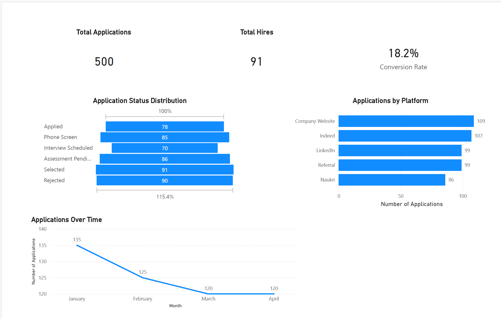

# Recruitment Analytics Dashboard | Power BI

A Power BI dashboard analysing recruitment performance, hiring funnel efficiency, and application sources.

## Overview
This project analyses job application data to understand hiring performance, candidate funnel progression, and platform effectiveness.

## Key Features
- Total Applications: 500
- Total Hires: 91
- Conversion Rate: 18.2%

## Insights
- Company websites and Indeed generated the highest number of applications
- Hiring funnel shows candidate progression across stages
- Applications declined slightly over time, stabilising in later months

## Tools Used
- Power BI
- Power Query
- DAX

## Dashboard Preview

